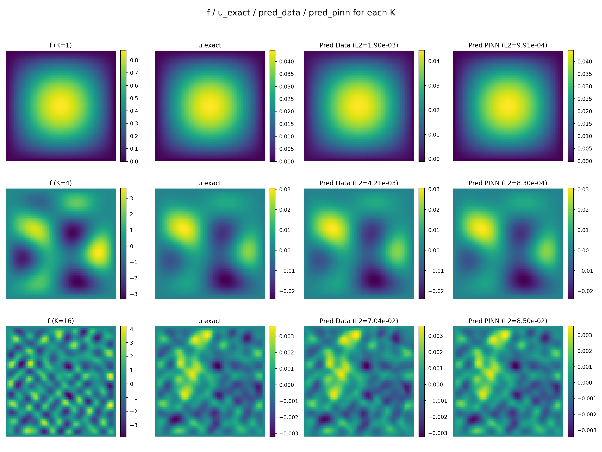
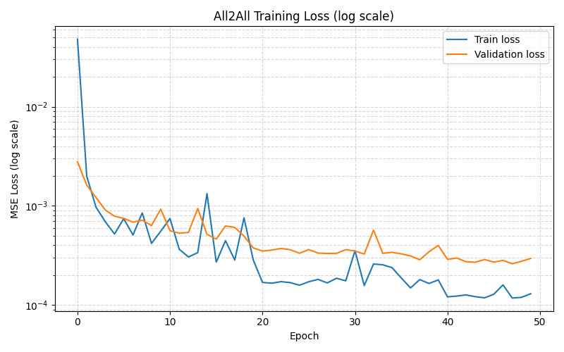
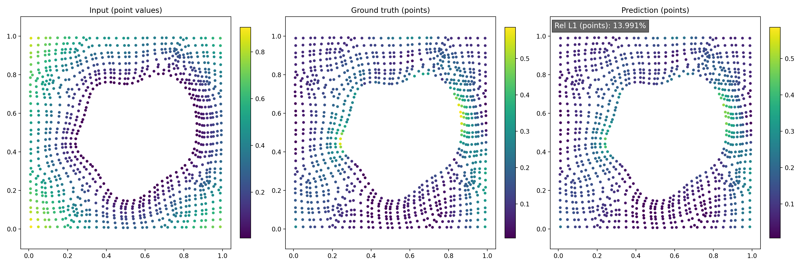

# Neural Operator Learning for PDE-Based Dynamical Systems


## Motivation

Traditional numerical solvers for complex physical systems (such as fluid mechanics and Navier-Stokes equations) are notoriously computationally expensive and slow. Driven by a deep interest in accelerating these simulations, I developed this project to explore and optimize state-of-the-art Deep Learning architectures for solving Partial Differential Equations (PDEs) and modeling continuous dynamical systems.

This repository contains the source code, datasets, and analysis of my research into Physics-Informed Neural Networks (PINNs), Fourier Neural Operators (FNOs), and Geometry-Aware Operator Transformers (GAOT).

## Key Architectures & Achievements

### 1. Physics-Informed Neural Networks (PINNs) & Loss Landscapes
Solving a multi-scale Poisson equation by comparing a purely supervised Data-Driven approach with a PINN approach.
* **Curriculum Training:** Implemented a progressive training scheme to overcome PINN convergence failures on high-frequency targets ($K=16$).
* **Loss Landscapes Visualization:** Generated 3D visualizations of the optimization space around local minima to analyze the stiffness and complexity of physics-informed gradients.

<p align="center">
  
  <br>
  <em>Figure 1: Input and Ground Truth vs Data-Driven and PINN Model Prediction </em>
</p>

### 2. Fourier Neural Operators (FNO) and Transfer Learning
Training an FNO to approximate the evolution of an unknown dynamical system over time.
* **Spectral Convolutions:** Implemented via FFT for one-to-one and all-to-all mappings[cite: 517, 579, 580].
* **Transfer Learning:** Demonstrated the model's adaptability to a distribution shift in initial conditions. [cite_start]By fine-tuning on only 32 trajectories, the relative $L_2$ error was drastically reduced from 15.85% (zero-shot) to 11.75%[cite: 667, 668].

<p align="center">
  
  <br>
  <em>Figure 2: Training and validation loss function of the all to all model </em>
</p>

### 3. Geometry-Aware Operator Transformer (GAOT)
Extending the classic GAOT architecture to make it robust to irregular geometries.
**Random Sampling & Dynamic Radius:** Replaced the structured grid tokenization with random spatial sampling using a dynamic aggregation radius based on local density (inspired by RIGNO) via KD-Tree queries[cite: 798, 861].
**Positional Encoding & Perceiver:** Implemented continuous relative biases (CRB) and a Cross-Attention compression mechanism (Perceiver)[cite: 895, 896, 918]. [cite_start]This allowed processing 1024 latent tokens while maintaining a competitive $L_1$ error (16.44%) and reducing computational cost[cite: 925].

<p align="center">
  
  <br>
  <em>Figure 3: Ground truth vs Gaot model prediction for strategy I  </em>
</p>

---

## Project Structure

```text
├── assets/                 # Generated visualizations organized by model
│   ├── PINNs/              
│   ├── FNOs/               
│   └── GAOT/               
├── datasets/               # Training, validation, and testing datasets (.npy files)
├── docs/                   # Detailed project report (mathematical analysis and results)
├── src/                    # PyTorch source codes for the 3 main tasks     
│   ├── run_pinn.py         # (Adapt these filenames to your actual scripts)
│   ├── run_fno.py          
│   └── run_gaot.py         
└── README.md

```

## Detailed Report

For an in-depth analysis of error metrics, hyperparameter configurations, and physical observations, please refer to the complete Project Report (PDF) located in the docs folder.